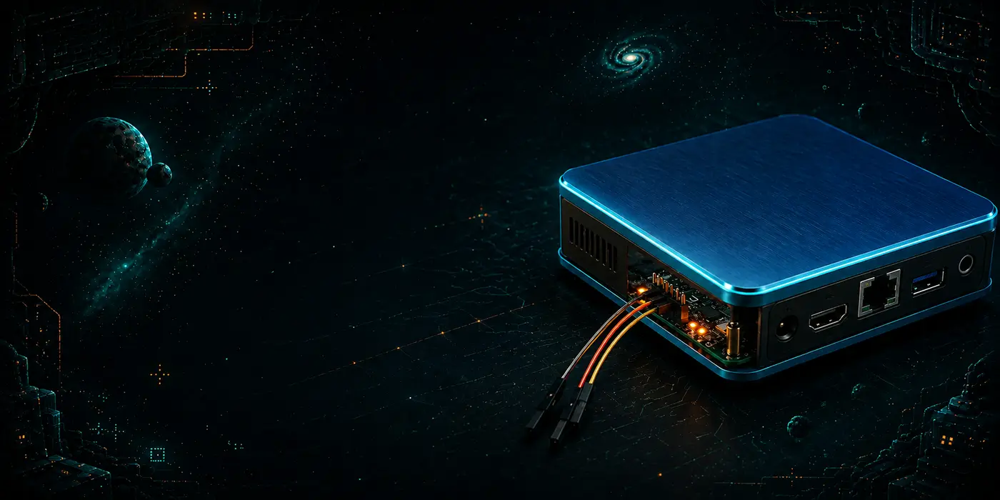

<p align="center">
  
</p>

<h1 align="center">GOLDFINGER ARMBIAN</h1>

<p align="center">
  <strong>Community Linux recovery for the blue metal enclosure TV box.</strong><br>
  <sub>A GRMCRKRS hardware-revival project.</sub>
</p>

<p align="center">
  
  
  
</p>

<p align="center">
  <a href="#beginner-workflow">Quick start</a> ·
  <a href="docs/hardware.md">Hardware</a> ·
  <a href="docs/status.md">Test status</a> ·
  <a href="#support-this-work">Support this work</a>
</p>

---

Community Armbian image, board support, and installation workflow for the TV box
whose PCB is marked:

```
GOLDFINGER_V14
2021-12-07
```

The validated hardware is an Amlogic SM1/S905X3 board with 2 GiB RAM, 16 GiB
eMMC, RTL8211F Gigabit Ethernet, and an AP6398S wireless module. A matching case
or product name is not enough: stop if the PCB date differs or is absent.

This is community support, not an official Armbian board. The public image is
vanilla apart from required board identification and hardware support. It has no
personal accounts, passwords, network profiles, remote-access enrollment, or
owner branding.

## Validated result

The release candidate has passed:

- verified image construction and byte-for-byte USB writing;
- UART-assisted cold USB boot on an untouched second unit;
- guarded installation to eMMC while retaining the factory U-Boot binary;
- unattended USB-free eMMC cold boot;
- automatic USB recovery precedence over the installed eMMC system; and
- Ethernet, dual-band Wi-Fi hardware, Bluetooth, HDMI, USB, and analog-audio
  validation on reference hardware.

The exact test history and remaining non-blocking coverage gaps are in
[docs/status.md](docs/status.md).

> **Release availability:** the audited source and documentation are public, but
> the finished binary image is not downloadable yet. Redistributable AP6398S
> inputs have been identified and pinned; the replacement image still needs its
> final build and wireless regression. Do not substitute the generic ophub base
> image: it lacks the complete tested board integration and guarded installer.

## Beginner workflow

### 1. Prepare the USB

Download these two assets from the project release page:

- `Armbian_26.08.0_amlogic_goldfinger-v14-2021-12-07_noble_6.12.103_server_2026.09.03.img.gz`
- the matching `.img.gz.sha256` file

Verify the download on Linux:

```sh
sha256sum -c Armbian_26.08.0_amlogic_goldfinger-v14-2021-12-07_noble_6.12.103_server_2026.09.03.img.gz.sha256
```

Flash the compressed image with Balena Etcher, Raspberry Pi Imager, or another
writer that verifies the result. Select the whole removable USB disk, not a
partition. Every existing file on that USB will be destroyed.

The tested port on the box is the blue **B1** USB port.

### 2. Connect UART and run the helper

On Ubuntu or Debian:

```sh
sudo apt-get update
sudo apt-get install git picocom python3
```

Clone this repository, enter it, and run:

```sh
./boot-device.sh
```

The helper explains the 3.3 V UART wiring, waits while the box is powered off,
finds the UART adapter, interrupts the factory countdown, starts the USB, loads
the audited RAM-only boot script, and opens picocom for Armbian's first login.
It does not write eMMC or save U-Boot variables.

Use only a **3.3 V TTL** UART adapter at 115200 8N1. Connect box TX to adapter
RX, box RX to adapter TX, and ground to ground. Never connect either power rail.
See [docs/hardware.md](docs/hardware.md) for the tested development-board example.

If the helper cannot recognize a bootloader variation, use the documented manual
spacebar procedure in [docs/install.md](docs/install.md).

### 3. Test before installing

Complete Armbian's local first-login setup, then confirm the running filesystems:

```sh
findmnt /
findmnt /boot
systemctl --failed
```

Both mounts must be on the USB, normally `/dev/sda2` and `/dev/sda1`, and eMMC
must not be mounted. Also test the hardware you care about. If this repository is
cloned on the box, `sudo ./scripts/verify.sh` provides an additional privacy-safe,
read-only baseline. Do not install merely because the login prompt appeared.

### 4. Install to eMMC

From the working USB system:

```sh
sudo armbian-install
```

This image automatically selects the validated Goldfinger profile and ext4. The
installer verifies the exact PCB metadata and eMMC geometry, backs up protected
boot-chain regions to `/ddbr/goldfinger-v14-*` on the USB, writes and verifies
Linux, and only then asks twice before changing the saved boot instructions. It
does not replace the factory U-Boot binary.

When installation succeeds, run `poweroff`, disconnect power, remove the USB,
and reconnect power. The box should boot eMMC unattended.

Do not erase the installation USB afterward. First copy its complete
`/ddbr/goldfinger-v14-*` directory elsewhere and verify `SHA256SUMS`. The supplied
USB writer refuses to erase media while that recovery directory remains present.

## Recovery

After eMMC activation, inserting the prepared USB in B1 takes precedence and
boots the recovery system automatically. An untouched factory box still requires
UART interruption. Keep a 3.3 V UART adapter and a verified image available.

The protected backup is useful for low-level repair, but restoration is not an
automatic factory-reset feature. Do not write raw backup regions without a
board-specific diagnosis. See [docs/safety.md](docs/safety.md).

## Source and porting work

The tested image is built from a fork pinned to the ophub revision recorded in
[docs/provenance.md](docs/provenance.md). The Goldfinger board overlay and generic
installer-hook changes will be published as the upstream-reviewable source patch.
Ordinary users should flash the finished release image rather than reconstructing
an intermediate USB with older staging scripts.

The proposed change split and generated-file policy are documented in
[docs/upstream.md](docs/upstream.md).

## Support this work

This project started with discarded hardware, jumper wires, and a serial console.
Support helps cover additional boxes, UART adapters, removable media, test
displays, and the time required to turn one successful rescue into a careful,
repeatable public process.

**A direct donation link is being configured.** In the meantime, starring the
repository, sharing the exact PCB/date with other owners, and contributing
carefully redacted test results all help.

GitHub can display a native **Sponsor** button once a funding destination is
selected. The maintainer setup and supported options are in
[docs/funding.md](docs/funding.md).

## License

Project-authored device-tree and script changes are GPL-2.0-or-later. Armbian,
Ubuntu, Linux, firmware, and other included components retain their own licenses.
The AP6398S firmware sources, licenses, hashes, and remaining physical regression
gate are recorded in [docs/redistribution.md](docs/redistribution.md).
